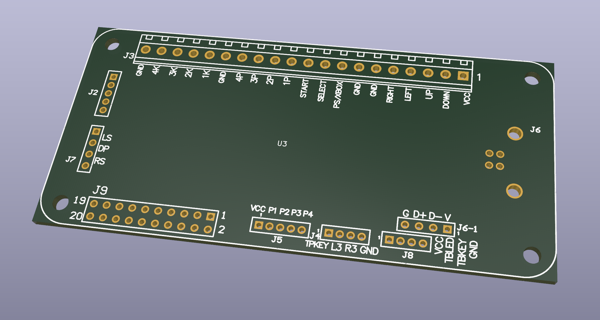
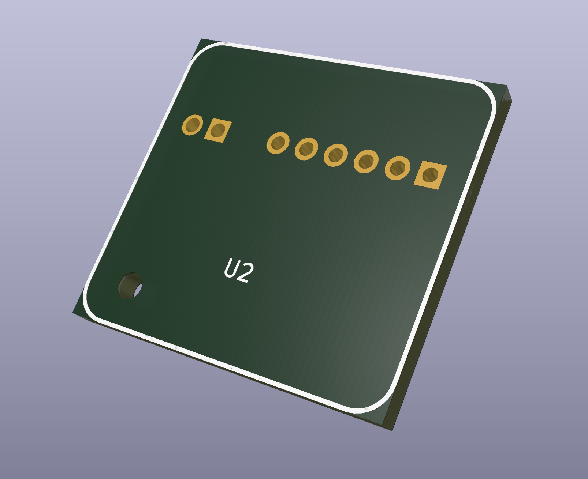

# Brook KiCad resources for fightstick builders

## IMPORTANT: CLONE THIS REPO TO YOUR COMPUTER ASAP IN CASE OF COPYRIGHT CLAIM:

```
git clone git@github.com:JohnFajardo/Brook-Kicad-Resources.git
```

Brook don't like to share even their dimensional drawings (ironic after illegaly reverse engineering the DualShock and DualSense handshake) so I made this so anyone can build their own PCB's.




These were both tested against a real life UFB and UP5 for correct fit, but feel free to open an issue if you find anything wrong.